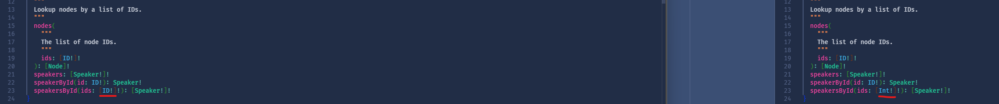

GraphQL

GraphQL - it's technology agnostic, but commonly uses http. It's like REST but on steroids. It allows you to move away from the ReST verbs into a more natural, domain language. 
But it's not a free for all like we currently have where you can go a bit nuts with RPC function names meaning for example you're not sure if the method you're calling is doing an update or is just querying data. 
GraphQL nicely separates definitions into queries and mutations. You could of course abuse this, but I would recommend not doing that. Queries should only return data, not mutate data.


HotChocolate
	- how many downloads
	- actively developed
	- benefits vs other libraries


Show the GraphQL Schema Definition using Banana Cake Pop for the demo project - show you can download it as SDL.
Queries
Mutations
Types
Payloads
Inputs

Demo a query or two
Demo a mutation or two	

Show the wiring up in program

Using one of queries, dig into the code a little bit
	
Using one of mutations, dig into the code a little bit
	

Data Loaders
	- you need to imlement that abstract method LoadBatchAsync - this returns many of whatever it is you want using keys as the look up.
	- you then get the retrieval of a single value for free  there's a LoadAsync method in the base class that calls the LoadBatchAsync method with one key.
	

Queries - e.g. SpeakerQueries
From the name of the method the query name in the schema definition is derived.

e.g. GetSpeakerAsync becomes Speaker in the SD.


This is the difference when the ID attribute is used.:
```
[ID(nameof(Speaker))]
```
